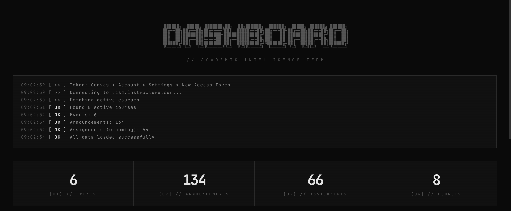

# canvas-mono

Integration with Canvas LMS API to aggregate assignments, events, and announcements into more visually appelaing format.

> [!WARNING]
> Need to be using a UNIX based system with chromium installed because script disables CORS on chromium to make sure the API calls work correctly

## Script Usage
run the script with `./start-dashboard.sh`. This should create a server in the background that hosts the app locally. To stop the server, run `./start-dashboard.sh stop`.

## App Usage

Add your school's canvas domain and input Canvas access token. If you do not have a Canvas access token, go to Account -> Settings -> New Access Token. Set the token to expire at the latest (~130 days).

## License

Everything in this repository is licensed under the MIT license.
